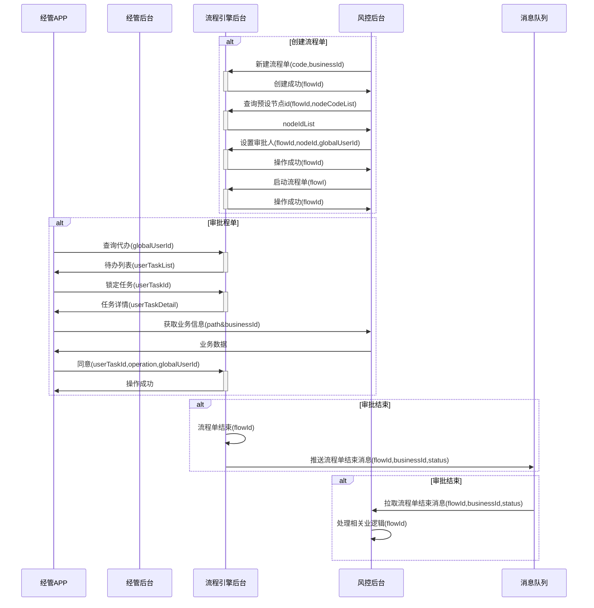

```mermaid
sequenceDiagram
participant a as 经管APP
participant b as 经管后台
participant c as 流程引擎后台
participant d as 风控后台
participant e as 消息队列

alt 创建流程单
d->>+c:新建流程单(code,businessId)
c->>-d:创建成功(flowId)
d->>+c:查询预设节点id(flowId,nodeCodeList)
c->>-d:nodeIdList
d->>+c:设置审批人(flowId,nodeId,globalUserId)
c->>-d:操作成功(flowId)
d->>+c:启动流程单(flowI)
c->>-d:操作成功(flowId)
end

alt 审批程单
a->>+c:查询代办(globalUserId)
c->>-a:待办列表(userTaskList)
a->>+c:锁定任务(userTaskId)
c->>-a:任务详情(userTaskDetail)
a->>d:获取业务信息(path&businessId)
d->>a:业务数据
a->>+c:同意(userTaskId,operation,globalUserId)
c->>-a:操作成功
end

alt 审批结束
c->>c:流程单结束(flowId)
c->>e:推送流程单结束消息(flowId,businessId,status)
end

alt 审批结束
e->>d:拉取流程单结束消息(flowId,businessId,status)
d->>d:处理相关业逻辑(flowId)
end
```

